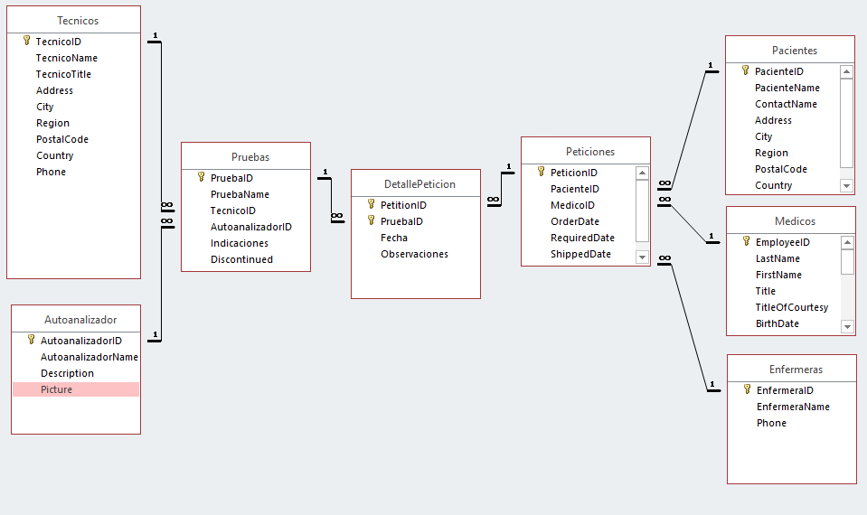

# Modelo Entidad-Relación

## Entidad
Clases de objetos de la realidad.

Cosa u objeto concreto o abstracto que existe, puede distinguirse de otros y del cual se desea almacenar información.

Ejemplo: Persona, departamento

Se representa con un rectángulo.

<small>Definición de cosa en la [RAE](https://dle.rae.es/cosa): 1. f. Lo que tiene entidad, ya sea corporal o espiritual, natural o artificial, concreta, abstracta o virtual.</small>

## Relación
Asociación entre dos entidades que puede tener o no existencia propia.
Asociación entre tablas mediante atributos que tienen el mismo dominio. 

Ejemplo: pertenece a, compuesto por

Se representa con un rombo.

## Tipos de relaciones

Grados de una relación
- 1:1 grado : plan de estudios
- 1:n asignatura : departamento
- n:n alumno : asignatura

Cuando puede ser 0 o 1, se designa como c. Por ejemplo, una persona puede tener teléfono de la empresa o no.

# Modelo Relacional
Definido por Codd en 1970.   
Los datos se estructuran lógicamente en forma de tablas.  
Las relaciones son referencias entre las tablas o/y nuevas tablas.  

Ejemplo: Pedido:articulos, la relación contiene el campo número de elementos de ese artículo.

## Tablas
Tabla: estructura de almacenamiento de datos compuesta de filas y columnas.

- El tipo de fila es único, dado por la definición de la tabla.
- No hay filas duplicadas.
- A cada columna la identifica un nombre.
- El valor de una columna para cada fila es único. (1ª forma normal)
- Los valores de una columna deben pertenecer al dominio que representa, que puede servir para varias columnas.

Dominio es el conjunto de valores posibles para un atributo, por ejemplo, los nombres de los departamentos de una empresa.

**Elementos de una tabla:**  
Columnas, campos o atributos
Filas, tuplas o registros

## Modelo relacional de caso Laboratorio

## Relación del Modelo E-R y modelo Relacional

##
<small>v1.09</small> [Edit](https://github.com/nicolasserrano/CS/edit/master/ADSI/ModeloER.md) - [File](https://github.com/nicolasserrano/CS/tree/master/ADSI/ModeloER.md) - [Folder](https://github.com/nicolasserrano/CS/tree/master/ADSI) - [View](https://nicolasserrano.github.io/CS/ADSI/ModeloER) - [Slides](https://www.nicolasserrano.com/r?https://www.nicolasserrano.com/CS/ADSI/ModeloER.md?breakTitlesWith#1)
