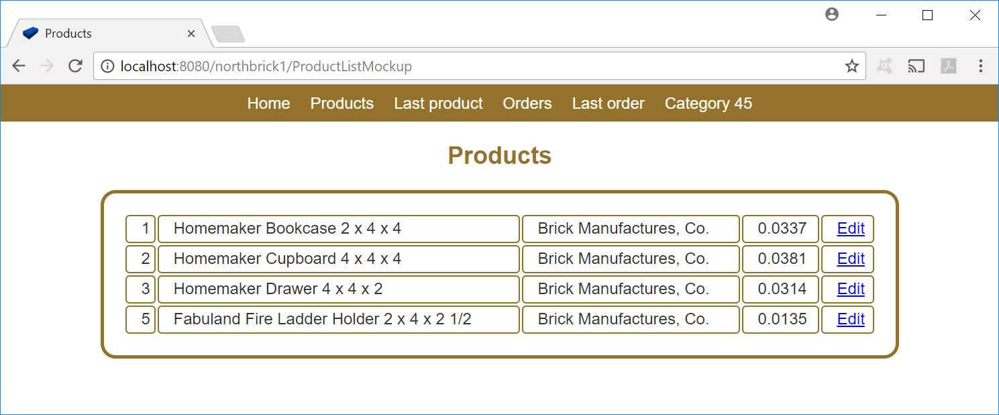

# JavaScript

In the servlet ProductListMockup, add a button with the caption "Add product", that adds a new row to the table of products, and contains the same information that the servlet ProductEditMockup (a form with the input data for the different fields of a product and a button to save this information with the servlet ProductSave).

# JSON

Create the servlet ProductJSONListMockup that shows the same information that the servlet ProductListMockup but sending the information with the data in a JSON structure instead of the HMTL to be rendered.

To do this follow the next steps:
1. Create a servlet that writes a JSON array with all the data of the Vector of Product data.
2. Verify with the browser that the JSON array is correctly defined.
3. Create a JavaScript function that reads this array and creates the same table that produces the origininal ProductListMockup.
4. Insert the JavaScript funcion in the html page with the tag 
