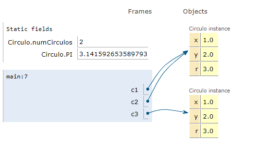

# Lenguaje Java

## Tipos de variables

```
boolean  1 byte. Valores true y false
char     2 bytes.Unicode . Comprende el código ASCII.
byte     1 byte. Entero entre -128 y 127
short    2 bytes.Entero entre -32768 y 32767
int      4 bytes.Entero entre -2.147.483.648 y 2.147.483.647
long     8 bytes.Entero entre -9.223.372.036.854.775.808 y 9.223.372.036.854.775.807
float    4 bytes.Real (entre 6 y 7 cifras decimales equivalentes).De -3.402823E38 a -1.401298E-45y de 1.401298E-45 a 3.402823E38
double   8 bytes.Real (15 cifras decimales equivalentes).De -1.79769313486232E308 a -4.94065645841247E-324y de 4.94065645841247E-324a 1.79769313486232E308
```

## Declaración de variables

**Ejemplos de declaración e inicialización de variables:**
```
int x;                          // Declaración de la variable primitiva x. Se inicializa a 0
int y = 5;                      // Declaración de la variable primitiva y. Se inicializa a 5
MyClass unaRef;                 // Declaración de una referencia a un objeto MyClass.
                                // Se inicializa a null
unaRef = new MyClass();         // La referencia “apunta” al nuevo objeto creado
                                // Se ha utilizado el constructor por defecto
MyClass segundaRef = unaRef;    // Declaración de una referencia a un objeto MyClass.
                                // Se inicializa al mismo valor que unaRef
int [] vector;                  // Declaración de un array. Se inicializa a null
vector = new int[10];           // Vector de 10 enteros, inicializados a 0
double [] v ={1.0, 2.65, 3.1};  // Declaración e inicialización de un vector de 3
                                // elementos con los valores entre llaves
MyClass[] lista=new MyClass[5]; // Se crea un vectorde 5 referencias a objetos
                                // Las 5 referencias son inicializadas a null
lista[0] = unaRef;              // Se asigna a lista[0] el mismo valor que unaRef
lista[1] = new MyClass();       // Se asigna a lista[1] la referencia al nuevo objeto
                                // El resto (lista[2]…lista[4] siguen con valor null
```

## Clase Circulo

   
```
public class Circulo {
    static int numCirculos = 0;
    public static final double PI=3.14159265358979323846;
    public double x;
    public double y;
    public double r;

    public Circulo(double x, double y, double r) {
        this.x=x;
        this.y=y;
        this.r=r;
        numCirculos++;
    }
    public Circulo(double r) {
        this(0.0, 0.0, r);
    }
    public Circulo(Circulo c) {
        this(c.x, c.y, c.r);
    }
    public Circulo() {
        this(0.0, 0.0, 1.0);
    }
    public double perimetro() {
        return 2.0 * PI * r;
    }
    public double area() {
        return PI * r * r;
    }
}
```
## Clase Circulo (parte 2)

```
// metodo de objeto para comparar circulos
    public Circulo elMayor(Circulo c) {
        if (this.r>=c.r) {
            return this;
        } else {
            return c;
        }
    }
    // metodo de clase para comparar circulos
    public static Circulo elMayor(Circulo c, Circulo d) {
        if (c.r>=d.r) {
            return c;
        } else {
            return d;
        }
    }
    // metodo de para imprimir coordenadas y radio
    public String toString() {
        return "x: " + x + " y: " + y + " r: " + r;
    }
} // fin de la clase Circulo
```
[Ver en Java Tutor](https://pythontutor.com/visualize.html#code=public%20class%20Circulo%20%20%7B%0A%20%20%20%20public%20static%20void%20main%28String%5B%5D%20args%29%20%7B%0A%20%20%20%20%20%20Circulo%20c1%20%3D%20new%20Circulo%281,2,3%29%3B%0A%20%20%20%20%20%20Circulo%20c2%20%3D%20c1%3B%0A%20%20%20%20%20%20Circulo%20c3%20%3D%20new%20Circulo%28c1%29%3B%0A%0A%20%20%20%20%7D%0A%20%20%20%20static%20int%20numCirculos%20%3D%200%3B%0A%20%20%20%20public%20static%20final%20double%20PI%3D3.14159265358979323846%3B%0A%20%20%20%20public%20double%20x%3B%0A%20%20%20%20public%20double%20y%3B%0A%20%20%20%20public%20double%20r%3B%0A%0A%20%20%20%20public%20Circulo%28double%20x,%20double%20y,%20double%20r%29%20%7B%0A%20%20%20%20%20%20%20%20this.x%3Dx%3B%0A%20%20%20%20%20%20%20%20this.y%3Dy%3B%0A%20%20%20%20%20%20%20%20this.r%3Dr%3B%0A%20%20%20%20%20%20%20%20numCirculos%2B%2B%3B%0A%20%20%20%20%7D%0A%20%20%20%20public%20Circulo%28double%20r%29%20%7B%0A%20%20%20%20%20%20%20%20this%280.0,%200.0,%20r%29%3B%0A%20%20%20%20%7D%0A%20%20%20%20public%20Circulo%28Circulo%20c%29%20%7B%0A%20%20%20%20%20%20%20%20this%28c.x,%20c.y,%20c.r%29%3B%0A%20%20%20%20%7D%0A%20%20%20%20public%20Circulo%28%29%20%7B%0A%20%20%20%20%20%20%20%20this%280.0,%200.0,%201.0%29%3B%0A%20%20%20%20%7D%0A%20%20%20%20public%20double%20perimetro%28%29%20%7B%0A%20%20%20%20%20%20%20%20return%202.0%20*%20PI%20*%20r%3B%0A%20%20%20%20%7D%0A%20%20%20%20public%20double%20area%28%29%20%7B%0A%20%20%20%20%20%20%20%20return%20PI%20*%20r%20*%20r%3B%0A%20%20%20%20%7D%0A%7D&cumulative=false&curInstr=0&heapPrimitives=nevernest&mode=display&origin=opt-frontend.js&py=java&rawInputLstJSON=%5B%5D&textReferences=false)
```
3	      Circulo c1 = new Circulo(1,2,3);
4	      Circulo c2 = c1;
5	      Circulo c3 = new Circulo(c1);
```


